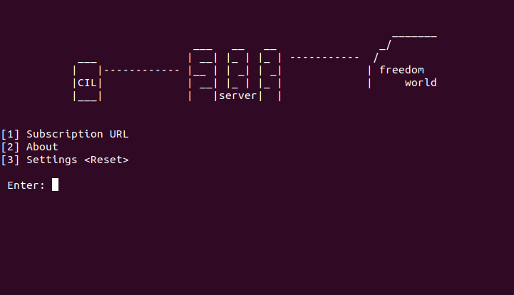

# v2rayT
 v2rayTerminal for linux terminal

### install v2rayT
#### [1] Open termianl and cd v2rayT folder
#### [2] sudo mv v2rayT.py /usr/sbin/v2ray && chmod a+x /usr/sbin/v2rayT
 
### use v2rayT
#### [1] Open terminal and input v2rayT
 
# Install v2ray
 <a href="https://www.v2ray.com/en/welcome/install.html">v2ray</a>

# Thanks
 Thanks for <a href="https://github.com/UncleBrook/v2rayT"> @UncleBrook</a> framework
